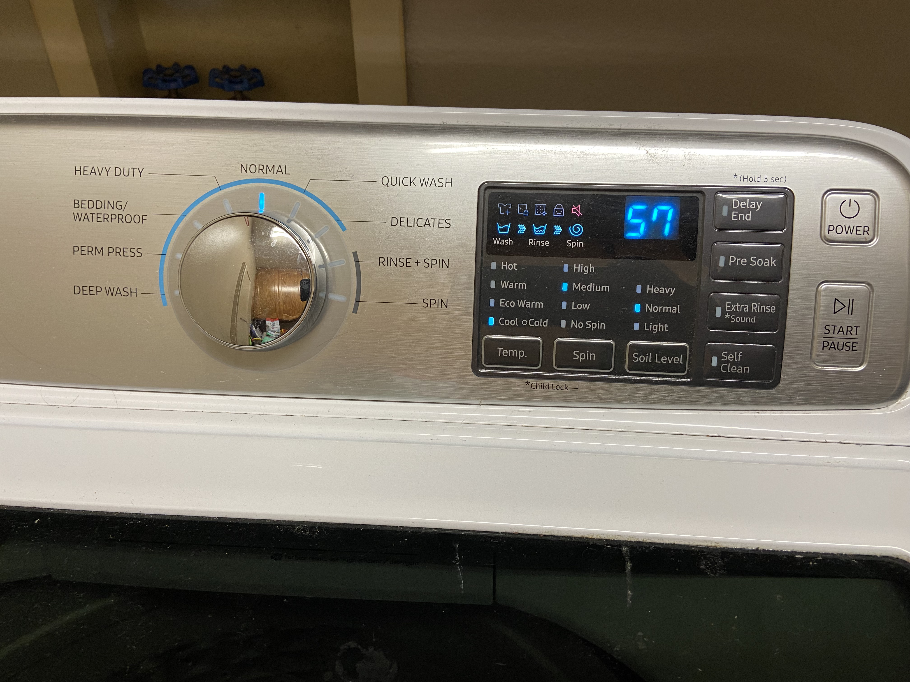

# Samsung Washer and Dryer - A User Experience

By Tai Masuda
05/17/2022

[Back to Home](https://usabilityengineering.github.io/ux-portfolio-tmasuda14/)

## Samsung VRTplus Washer

The Samsung VRTplus Washer provides a clean, yet detailed interface with numerous signifiers and affordances. The information is displayed with descriptive wording which reduces guesswork and increases learnability. Icons in the center become highlighted to notify the user of specific settings for each load. Icons even differentiate in color, with blue showing how your clothes will be washed, and red signifying a feature is disabled (the sound).

A user begins by pressing the power button at the top right corner, then spins the dial on the left to set the wash cycle. The user can then select from several customization options in the dark center control and finally press the start button on the bottom right. While the time to alternate from the left to right controls is small, overall efficiency may be improved by placing the power and start buttons to the left of the dial. 

The center control also allows for a child lock, which prevents accidental activation and increases its safety capabilities. The total time for the cycle is displayed prominently in the center and user satisfaction is high.

## Samsung MoistureSensor/SmartCare Dryer

The Samsung MoistureSensor/SmartCare Dryer is the worst dryer I have ever used. Although it deploys a vaguely similar setup to the washer, this dryer decides to take every previous feature and make it worse. There is still a child lock feature, but the locking mechanism is not obvious to a new user. 

Spinning the left dial to ANY setting other than TIME DRY will have your load ending prematurely, and if you don’t restart it soon enough, you will end up with musky semi-dried clothes. This feature is promoted as MoistureSensor/SmartCare to save energy, but it inadvertently causes a dramatic reduction in user satisfaction. The only way to guarantee dry clothing with a single cycle is to set the dial to Time Dry and push the “Time” button under the display to either 40 or 60 minutes. Even setting max dryness during a Normal cycle results in damp clothing. Because of this complicated workaround, the learnability and efficiency of this device suffer.

The absolute worst part of this technology is the inability to silence the obnoxious song which plays after each cycle [(Obnoxious Sound)](https://youtu.be/aHdG5M8aA4I). Because this is a cheap model, there is no way to disable the sound, again greatly reducing user satisfaction. 
